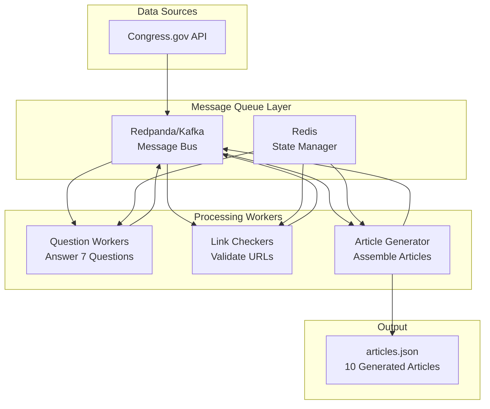
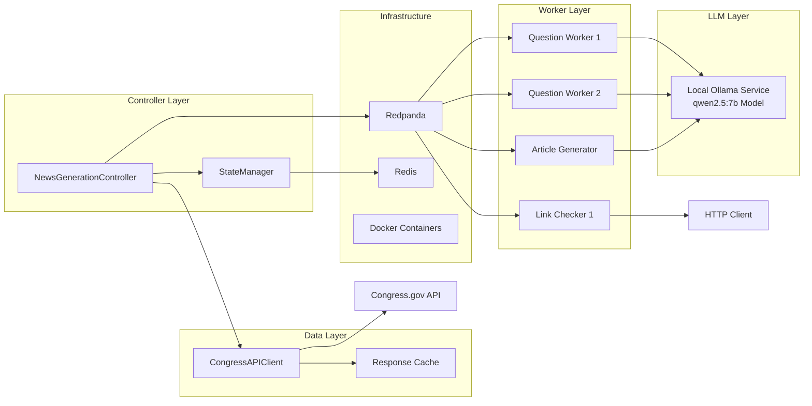
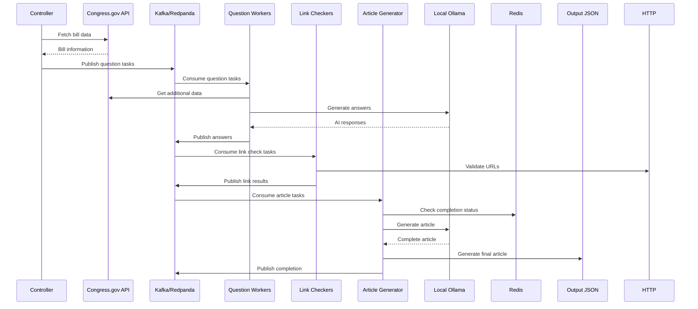
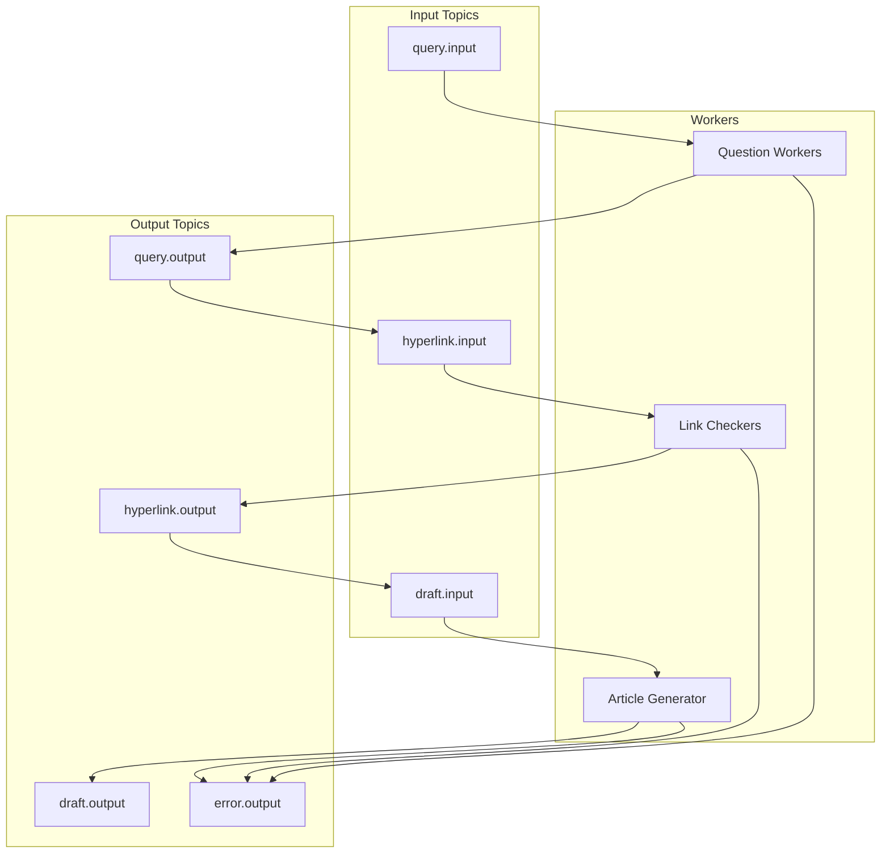
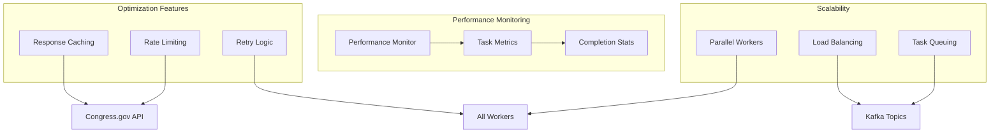
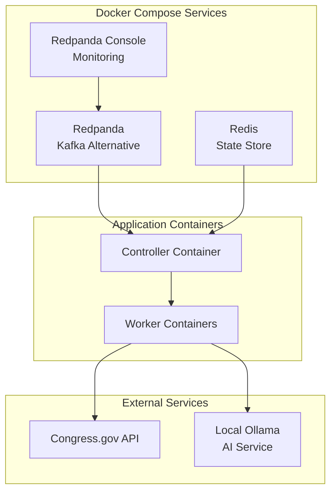
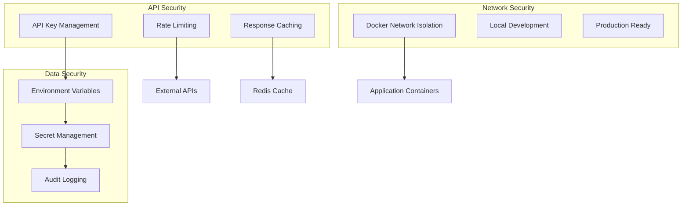

# System Architecture

## High-Level Architecture Diagram

## Detailed Component Architecture

## Data Flow Architecture

## Message Flow Architecture

## Performance Architecture

## Container Architecture

## Security Architecture

This architecture ensures:
- **Scalability**: Multiple workers can process tasks in parallel
- **Reliability**: Redis state management and retry logic
- **Performance**: Caching and rate limiting optimization
- **Monitoring**: Real-time progress tracking and metrics
- **Security**: API key management and network isolation
